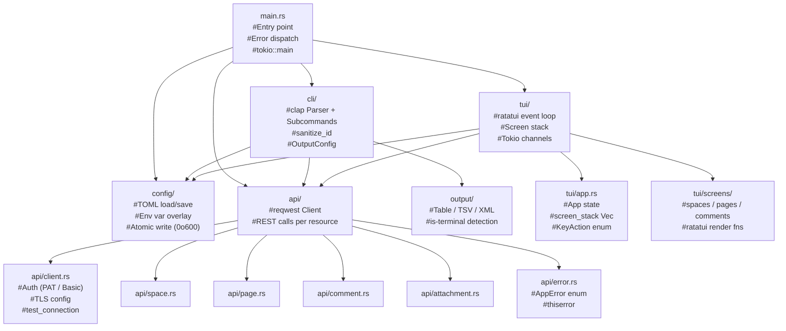
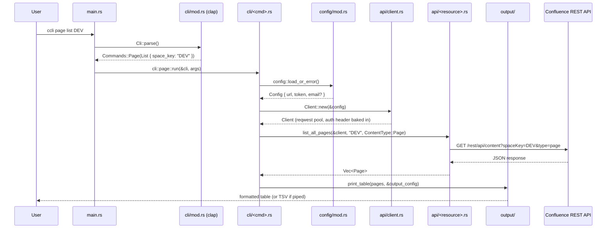
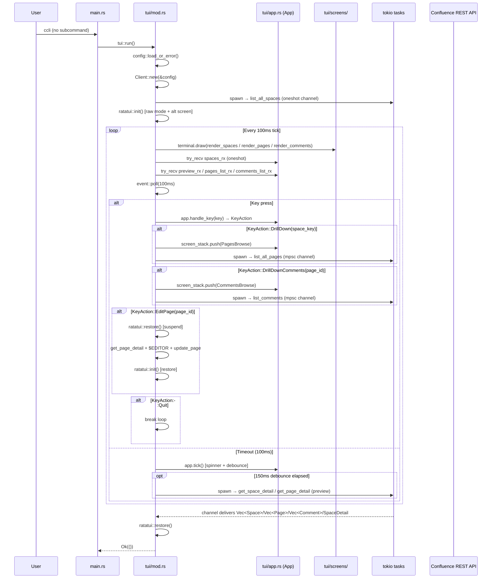
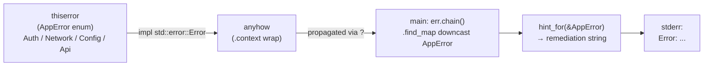

# ccli Architecture

`ccli` is a Confluence Data Center CLI written in Rust. It operates in two modes:
- **CLI mode** — `ccli <subcommand>` runs a single command and exits
- **TUI mode** — bare `ccli` launches a full terminal UI

---

## Module Map

---

## CLI Command Flow

---

## TUI Event Loop

---

## Error Handling Chain

---

## Key Rust Concepts in This Codebase

| Concept | Where to look |
|---|---|
| `#[derive]` macros (Parser, Serialize, Deserialize) | `cli/mod.rs`, `config/mod.rs`, `api/*.rs` |
| Enums as typed errors (`thiserror`) | `api/error.rs` |
| `anyhow::Result` + `.context()` for error wrapping | everywhere in handlers |
| `async`/`await` + `#[tokio::main]` | `main.rs`, `tui/mod.rs`, all API calls |
| Tokio channels (`oneshot`, `mpsc`) | `tui/mod.rs` — async results from spawned tasks |
| Ownership & cheap `Clone` via `Arc` | `api/client.rs` — `reqwest::Client` is Arc-backed |
| Pattern matching on enums | `main.rs` `match cli.command`, `tui/mod.rs` `match action` |
| `Option<T>` idioms (`take`, `as_deref`, `filter`) | `config/mod.rs`, `tui/mod.rs` |
| `Vec<Screen>` as a navigation stack | `tui/app.rs` `screen_stack` |
| Unit tests in the same file (`#[cfg(test)]`) | every module |
| `Mutex` for serializing parallel tests | `api/client.rs`, `config/mod.rs` |
