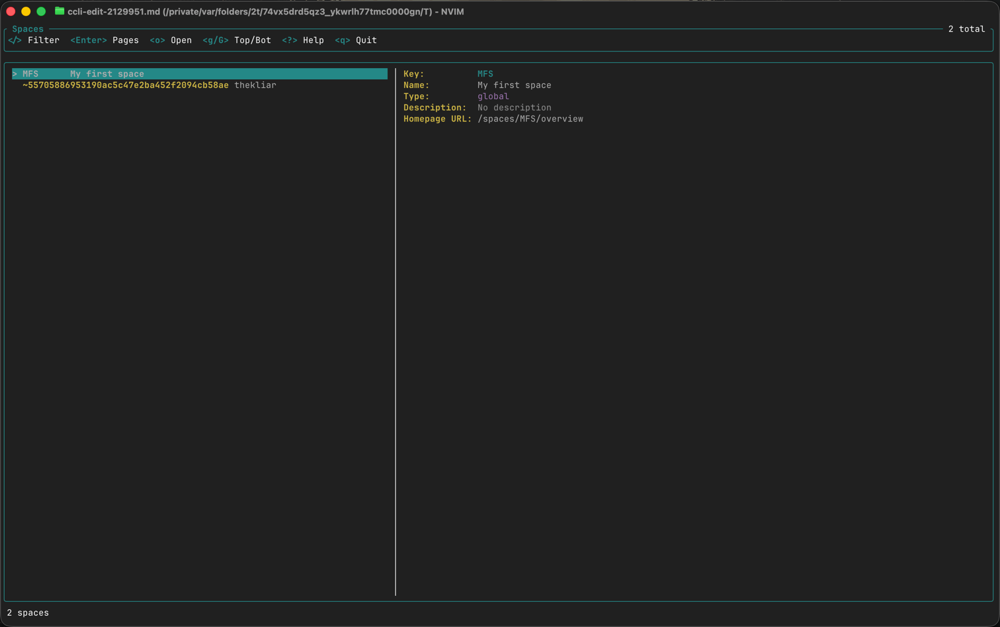
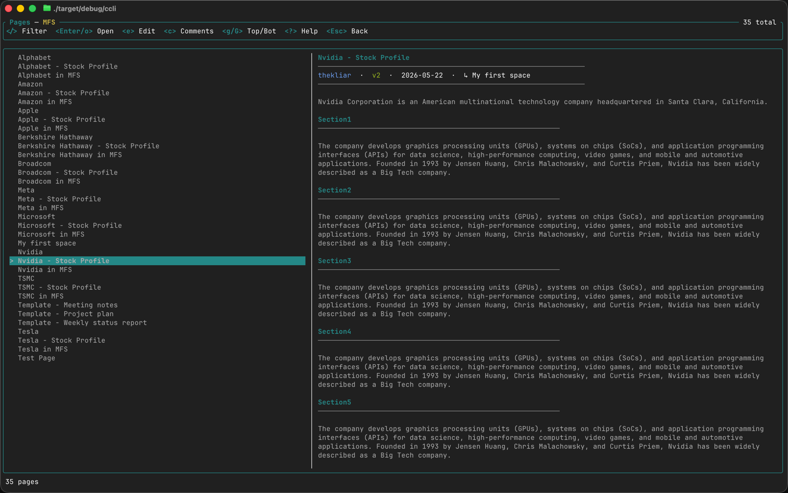
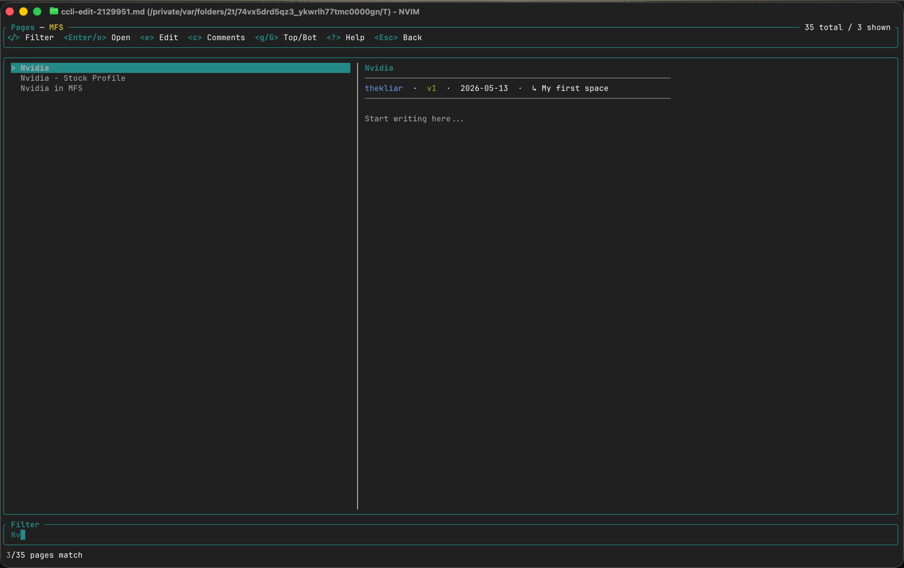

# ccli

Confluence CLI and terminal UI written in Rust, for when the browser tab count has become a moral issue.

`ccli` works with both **Confluence Data Center** and **Confluence Cloud**. It supports command-oriented usage and an interactive TUI, so you can browse, search, and edit Confluence content without leaving the terminal.

## ⚡ Installation

Grab a pre-built binary from the [latest release](https://github.com/kliarist/ccli/releases/latest), or build from source:

```bash
cargo install --path .
```

## ✨ Features

- 🖥️ Interactive TUI launched by running bare `ccli`
- 🔍 Fuzzy filtering in all list views
- 🖱️ Mouse scroll support — scroll the list or preview pane independently
- 🎨 Styled page preview: formatted headings, bullet lists, code blocks
- 📁 Space listing and browsing
- 📄 Page listing, viewing, searching, creating, and editing
- 📝 Blog post listing, viewing, creating, and editing
- 💬 Comment listing and plain-text authoring in `$EDITOR`
- 📎 Attachment listing, download, and upload
- 📊 Pretty table output for interactive terminals; TSV for pipes
- ✍️ Markdown editing via `pandoc` (auto-detected; falls back to raw XML)

## 🔧 Configuration

First-time setup:

```bash
ccli init
```

Prompts for a Confluence base URL and a Personal Access Token. The connection is validated before saving, so bad credentials do not get a permanent home.

Config file: `~/.config/ccli/config.toml`

```toml
url = "https://confluence.example.com"
token = "AT-xxxxxxxxxxxx"
```

Environment variable overrides (useful for CI and containers):

| Variable | Purpose |
|----------|---------|
| `CCLI_URL` | Confluence base URL |
| `CCLI_TOKEN` | Personal Access Token |
| `RUST_LOG` | Log level (e.g. `debug`) |

If both `CCLI_URL` and `CCLI_TOKEN` are set, `ccli` runs without a config file.

## 🖥️ TUI

Launch with:

```bash
ccli
```

### Spaces browse

The default screen lists all accessible spaces. The right pane shows a live preview of the selected space.



Press `Enter` to drill into a space and browse its pages.

### Pages browse

After pressing `Enter` on a space, the right pane renders the selected page content with styled headings, lists, and code blocks.



### Fuzzy filter

Press `/` to open the filter panel. Results update in real time as you type. `Esc` cancels and restores the full list; `Enter` commits the filter and keeps the narrowed view while you browse.



### ⌨️ Keyboard shortcuts

| Key | Action |
|-----|--------|
| `↑` / `↓` | Navigate list |
| `j` / `k` | Navigate list (vim-style) |
| `g` / `G` | Jump to top / bottom |
| `/` | Open fuzzy filter |
| `Esc` | Close filter / go back |
| `Enter` | Drill into space or open page in browser |
| `o` | Open in browser |
| `e` | Edit page in `$EDITOR` |
| `c` | View comments |
| `PgDn` / `PgUp` | Scroll page preview |
| `?` | Show key bindings |
| `q` | Quit |

### 🖱️ Mouse

- Scroll on the **left pane** to move the list selection up and down
- Scroll on the **right pane** to scroll the page preview

## 🛠️ CLI Commands

Top-level help:

```bash
ccli --help
```

### Identity

```bash
# Show the configured Confluence URL and email
ccli me
```

### Spaces

```bash
ccli space list
```

### Pages

```bash
# List pages in a space
ccli page list DEV

# View page content as plain text
ccli page view 123456

# Search with CQL
ccli page search "type=page AND space=DEV AND text~deploy" --limit 25

# Create a page (opens $EDITOR)
ccli page create --space DEV --title "Release Notes"

# Edit a page — Markdown if pandoc is installed, raw XML otherwise
ccli page edit 123456

# Edit a page, always raw Confluence storage XML
ccli page edit 123456 --raw
```

### Blog Posts

```bash
ccli blog list DEV
ccli blog view 123456
ccli blog create --space DEV --title "Weekly Update"
ccli blog edit 123456
ccli blog edit 123456 --raw
```

### Comments

```bash
# List comments on a page
ccli comment list 123456

# Add a comment (opens $EDITOR, plain text)
ccli comment add 123456
```

### Attachments

```bash
ccli attachment list 123456
ccli attachment get 123456 design.pdf
ccli attachment add 123456 ./design.pdf
```

## 📤 Output Modes

Global flags apply to all tabular commands:

```bash
ccli --plain --no-headers --columns key,name space list
```

| Flag | Effect |
|------|--------|
| _(none)_ | Formatted table on TTY, TSV when piped |
| `--plain` | Force TSV |
| `--no-headers` | Suppress header row |
| `--columns a,b` | Show only these columns, in this order |

## ✍️ Editor Integration

The following commands open `$EDITOR` (falls back to `$VISUAL`, then `vi`):

- `ccli page create` / `ccli page edit`
- `ccli blog create` / `ccli blog edit`
- `ccli comment add`

**Page and blog post editing** uses Markdown automatically when [`pandoc`](https://pandoc.org) is installed — install it with `brew install pandoc`. Without pandoc the file opens as raw Confluence storage XML. Pass `--raw` to any edit command to bypass pandoc and edit XML directly.

**Comments** are written as plain text and converted to storage format automatically.

## 🏗️ Build & Test

```bash
cargo build --release
cargo test
```

## 🧰 Tech Stack

| Concern | Crate |
|---------|-------|
| Async runtime | `tokio` |
| HTTP client | `reqwest` |
| CLI parsing | `clap` |
| TUI | `ratatui` + `crossterm` |
| Fuzzy matching | `nucleo-matcher` |
| XML parsing | `quick-xml` |

## 📜 License

MIT. See [LICENSE](LICENSE).

<a href='https://ko-fi.com/V7V81Z4ZAU' target='_blank'></a>
